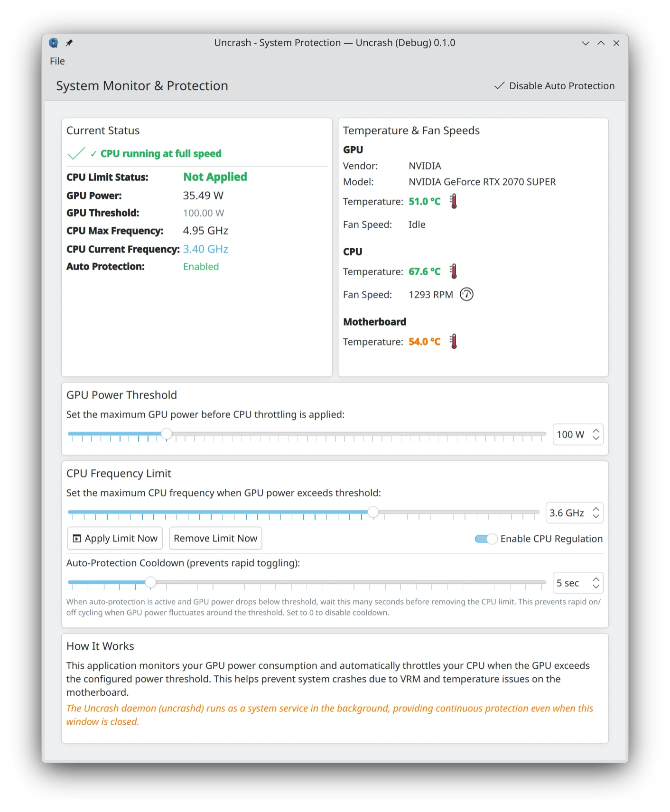

# [Uncrash](https://github.com/pbek/uncrash)

[Changelog](https://github.com/pbek/uncrash/blob/main/CHANGELOG.md) |
[Releases](https://github.com/pbek/uncrash/releases) |
[Issues](https://github.com/pbek/uncrash/issues)

[](https://github.com/pbek/uncrash/actions/workflows/build-nix.yml)

Uncrash is a **system protection daemon** that prevents desktop crashes caused by GPU power spikes, VRM overheating, and motherboard power delivery issues.



## 🎯 What Does It Do?

Uncrash monitors your GPU power consumption in real-time and automatically throttles CPU frequency when the GPU exceeds a configurable power threshold. This prevents system crashes by reducing total power draw when your hardware is under stress.

**Key Features:**

- 🔄 **Background daemon** - Runs as a systemd service, protecting your system 24/7
- 📊 **Real-time monitoring** - Tracks GPU power consumption every second
- ⚡ **Automatic throttling** - Dynamically limits CPU frequency when GPU power exceeds threshold
- 🎨 **GUI client** - Kirigami-based interface for configuration and monitoring
- 🔧 **DBus interface** - Control the daemon programmatically or via command-line
- 🐧 **NVIDIA & AMD support** - Works with both GPU vendors automatically
- 🔐 **Security hardened** - Systemd service runs with minimal privileges

## 🚀 Quick Start

### Option 1: Try the GUI (Testing)

```bash
nix run github:pbek/uncrash
```

> [!NOTE]
> Running the GUI this way will NOT enable system protection. The GUI is just a configuration/monitoring tool.
> To enable actual protection, you need to enable the systemd service (see Option 2).

> [!TIP]
> If Qt complains about different minor versions, you can try using your own nixpkgs:
>
> ```bash
> nix run github:pbek/uncrash --override-input nixpkgs nixpkgs
> ```

### Option 2: Install the Service (Recommended)

Enable Uncrash as a NixOS system service for continuous protection:

```nix
# In your flake.nix inputs
inputs.uncrash.url = "github:pbek/uncrash";
inputs.uncrash.inputs.nixpkgs.follows = "nixpkgs";

# In your NixOS configuration
{
  imports = [ inputs.uncrash.nixosModules.uncrash ];

  services.uncrash = {
    enable = true;
    gpuPowerThreshold = 100;  # GPU power in watts (default: 100)
    cpuMaxFrequency = 3.5;    # CPU frequency in GHz when throttling (default: 3.5)
    autoProtection = true;    # Enable automatic throttling (default: true)
  };
}
```

After enabling, the `uncrashd` daemon will:

- ✅ Start automatically on boot
- ✅ Monitor GPU power continuously
- ✅ Apply CPU throttling when GPU exceeds threshold
- ✅ Run in the background (no GUI required)

You can then use the GUI to monitor status and adjust settings:

```bash
uncrash
```

## 🎛️ Configuration

### NixOS Module Options

#### `services.uncrash.enable`

- **Type**: `boolean`
- **Default**: `false`
- **Description**: Enable the Uncrash system protection daemon.

#### `services.uncrash.package`

- **Type**: `package`
- **Default**: `pkgs.callPackage ./package.nix { }`
- **Description**: The Uncrash package to use. Override this to use a custom build.

#### `services.uncrash.gpuPowerThreshold`

- **Type**: `integer` (watts)
- **Default**: `100`
- **Description**: GPU power threshold in watts. When GPU power exceeds this value, CPU throttling will be applied.

#### `services.uncrash.cpuMaxFrequency`

- **Type**: `float` (GHz)
- **Default**: `3.5`
- **Description**: Maximum CPU frequency in GHz when GPU power threshold is exceeded.

#### `services.uncrash.autoProtection`

- **Type**: `boolean`
- **Default**: `true`
- **Description**: Enable automatic CPU throttling when GPU power exceeds threshold.

### Manual Service Control

```bash
# Start the daemon
sudo systemctl start uncrashd

# Stop the daemon
sudo systemctl stop uncrashd

# Check status
sudo systemctl status uncrashd

# View logs
journalctl -u uncrashd -f

# Restart the daemon
sudo systemctl restart uncrashd
```

### Configuration File

Settings are stored in `/etc/uncrash/uncrash.conf`:

```ini
[General]
gpuPowerThreshold=100
cpuMaxFrequency=3.5
autoProtection=true
```

## 📖 How It Works

1. **GPU Monitoring**: The daemon continuously monitors GPU power consumption using:
   - `nvidia-smi` for NVIDIA GPUs
   - `/sys/class/drm/card*/device/hwmon/hwmon*/power1_average` for AMD GPUs

2. **Threshold Detection**: When GPU power exceeds the configured threshold, the daemon triggers CPU throttling.

3. **CPU Throttling**: The daemon writes to `/sys/devices/system/cpu/cpu*/cpufreq/scaling_max_freq` to limit CPU frequency (requires root privileges).

4. **Automatic Recovery**: When GPU power drops below the threshold, CPU frequency limits are automatically removed.

5. **DBus Communication**: The GUI client communicates with the daemon via DBus (`org.uncrash.Daemon`), allowing real-time monitoring and configuration changes.

## 🖥️ Architecture

```
┌─────────────────┐
│   uncrash GUI   │  (User Interface)
│   (KF6/QML)     │
└────────┬────────┘
         │ DBus: org.uncrash.Daemon
         │
┌────────▼────────┐
│   uncrashd      │  (System Daemon)
│  (systemd)      │  - Runs as root
│                 │  - Monitors GPU power
└────┬───────┬────┘  - Controls CPU frequency
     │       │
     │       └──────► /sys/devices/system/cpu/.../scaling_max_freq
     │
     └──────────────► nvidia-smi / /sys/class/drm/card*/hwmon/
```

## 🛠️ Technology Stack

- **Language**: C++ (Qt6)
- **UI Framework**: QML with KDE Kirigami
- **Build System**: CMake 3.20+
- **Dependencies**:
  - Qt6 (Core, Gui, Qml, Quick, Widgets)
  - KDE Frameworks 6
  - KF6 Kirigami

## 🔨 Building

### Prerequisites

This project uses `devenv` for a reproducible development environment with all necessary dependencies:

```bash
# Enter the development shell
devenv shell

# Or use direnv (if configured)
direnv allow
```

### Using Just Recipes

The project provides Just recipes for common build and development tasks:

```bash
# Configure the project with CMake
just build

# Run the application
just run

# Build the nix package
just nix-build

# Run the application from the nix package
just nix-run
```

## 📄 License

See [LICENSE.md](LICENSE.md) for details.

## 🤝 Contributing

This is an early-stage project. Contributions are welcome!

> [!NOTE]
> This project was developed with AI assistance.
